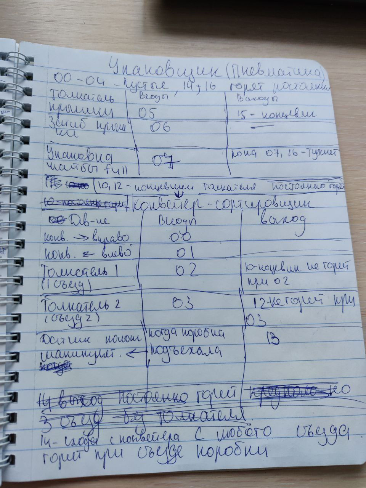
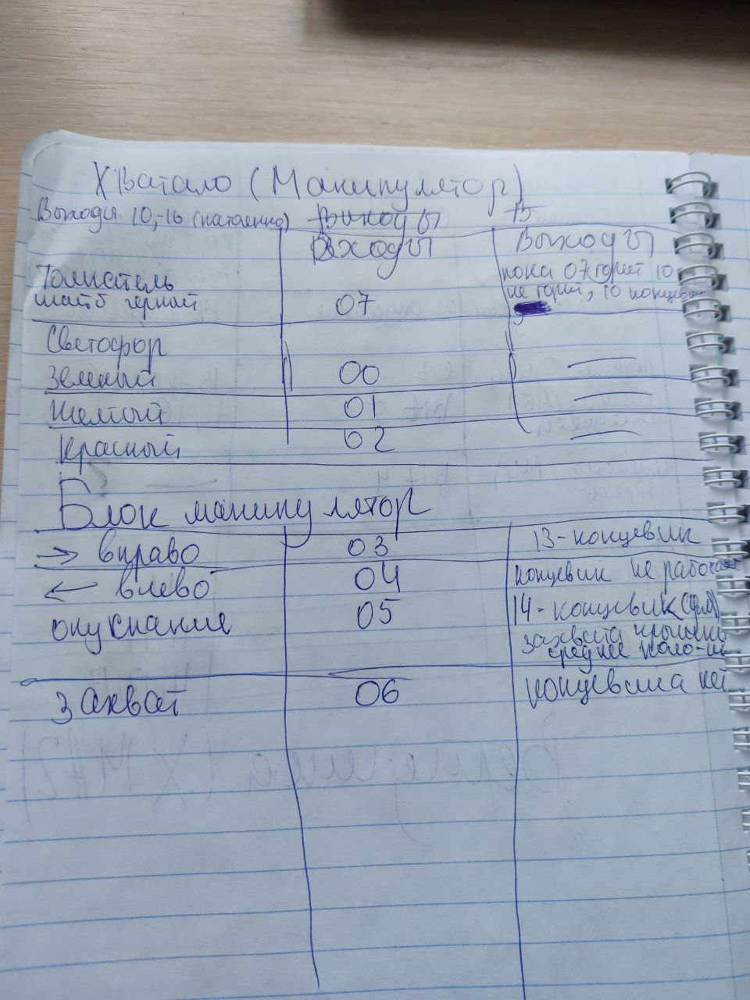
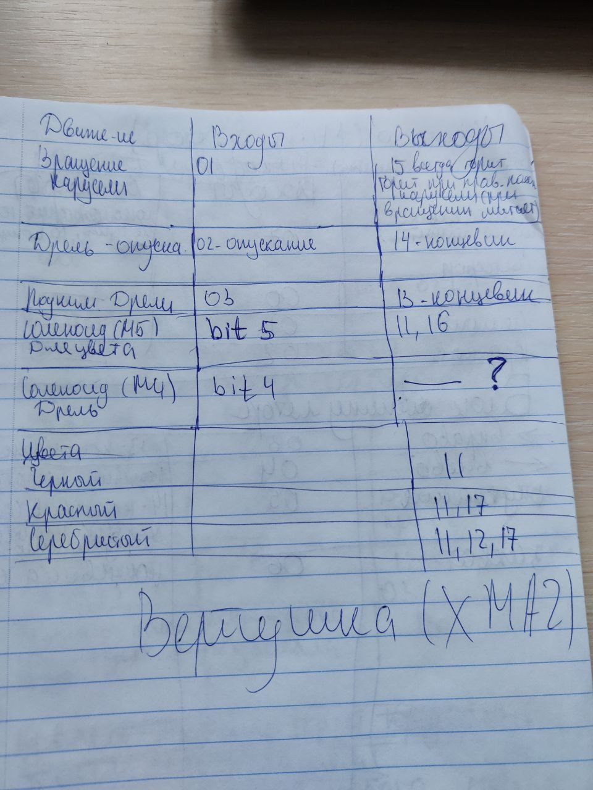

Отчет о проделанной работе
Цель
Целью данного отчета является документирование проделанной работы в рамках проекта.

Проделанная работа
Ознакомление с установкой: Был проведен анализ процесса установки, изучены требования и шаги, необходимые для успешной установки.

Сбор информации по входам и выходам: Была проведена работа по сбору информации о входных и выходных данных проекта. Это включало в себя анализ форматов данных, потоков информации и требований к обработке.

Встреча с Евгением: Проведена встреча с коллегой Евгением для обсуждения текущего состояния проекта, обмена идеями и выявления возможных улучшений и исправлений.

Заключение
В ходе проделанной работы были выполнены основные задачи, связанные с изучением установки, сбором информации о входах и выходах проекта, а также проведена встреча с коллегой для обсуждения текущих вопросов. Дальнейшие шаги включают анализ собранной информации и планирование дальнейших этапов проекта.